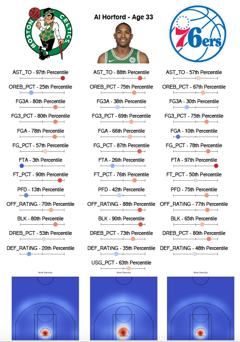
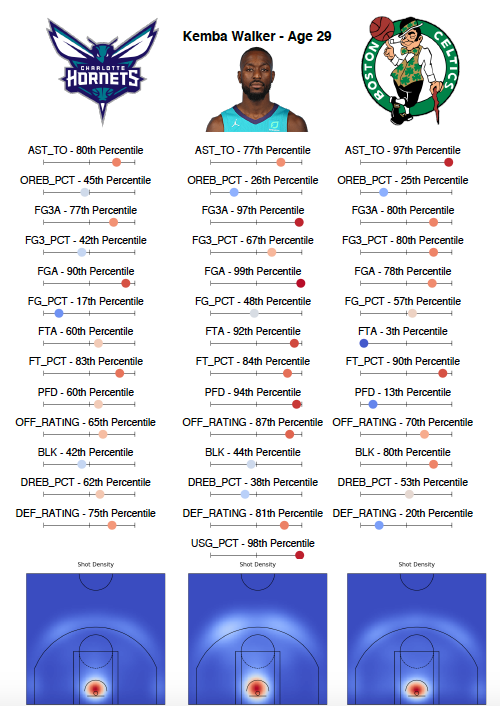

# team_additions
Visualizing team and player statistics in the context of transactions

## Results

The sheet below shows the roster addition sheet for Al Horford moving from the Celtics to the 76ers.

- Horford's high assist-to-turnover ratio should be a great benefit to the 76ers. Joel Embiid struggles with turnovers, so the team could use a big that can both distribute and protect the ball.
- The Celtics need to replace Horford's rebounding. The team was not elite at rebounding on either side of floor, but Horford was above average.
- Horford will help the 76ers on both ends of the floor, with above average offensive and defensive rating. The 76ers should see their rim protection get even better with Horford's 90th percentile blocks per 100 possessions.

Also, here's the roster addition sheet for Kemba Walker moving from the Hornets to the Celtics.

- Walker's three-point shooting will fit right in with the Celtics, indicated by his shot distribution chart and three-point field goal percentage.
- Perhaps Walker's most attractive quality to the Celtics is his ability to get to the free throw line. The Celtics were very poor at this last year, while Kemba is elite.
- Walker is not the greatest defender, so Marcus Smart will need to be relied on heavily to defend the opposition's best guards.
